# 1、信息表

| 项目   | 内容                              |
| ---- | ------------------------------- |
| 作品名称 | 边缘行者                            |
| 队伍名称 | 边缘行者（bianyuanxingzhe）           |
| 指导教师 | 修佳鹏                             |
| 专属仓库 | contest2026_313_bianyuanxingzhe |
| 选题方向 | AI 硬件产品创新                       |
| 截止提交 | 2026-09-20                      |

## 1.1 团队分工

| 成员  | 职责                                                          | 代码占比（约） |
| --- | ----------------------------------------------------------- | ------- |
| 郑子轩 | 硬件接线、主程序、预警 UI、蜂鸣、WiFi AT/UI、串口 `@` 遥控、屏镜像、烧录演示           | 55–61%  |
| 王筠昊 | LD2451 帧解析、ew_decide 门限、host_smoke 回归                       | 10–15%  |
| 韦政宇 | Agent 对话页、LLM（MiMo）、Skill approach-warn、Tool approach_alert | 29–35%  |

*占比按 `app/edge_walker/` 模块文件行数归属估算，**不含**自动生成字库 `ew_font_cjk_18.c`。*

# 2、摘要

“边缘行者”面向城市步行中的侧后方自行车（含共享单车）及静音电动车接近场景，采用 openvela、LVGL 与 LD2451 毫米波雷达构建端侧预警原型。系统完成三页 LVGL UI、LD2451 UART 解析与本地门限判定，告警由 `alert_output()` 统一驱动。**主机侧 `host_smoke` 回归 ALL PASS**，`ew fake` 可验证告警链路，断网状态下仍可本地预警。视频含自行车与电动车道路接近定性演示。AI 采用 Skill `approach-warn` 主动调用 `approach_alert`，MiMo 仅用于对话，不参与测距和安全判决。

**关键词**：openvela；LD2451；端侧预警；LVGL；AI Agent；Skill

# 3、正文

## 3.1 绪论

### 3.1.1 问题背景

城市步行环境中，行人主要依赖视觉与听觉感知周围交通目标。对于从侧后方接近的自行车（含共享单车）及静音电动车，尤其在环境噪声较大或注意力集中于前方时，存在感知盲区。

“边缘行者”针对这一场景，设计部署于行人端的端侧感知与主动告警原型。系统使用毫米波雷达感知附近目标，在本地完成门限判断，并通过屏幕颜色和蜂鸣器进行分级提醒。

当前产品定位为辅助安全提醒设备，不替代盲杖、导盲犬以及车辆端开门预警等专业安全设备。

### 3.1.2 产品形态

竞赛阶段采用 `SF32LB52-DevKit-LCD` 主控开发板与外挂 `HLK-LD2451` 雷达构成原型系统。未来产品形态定位为腰戴式环状设备，该形态在本阶段尚未完成。

系统提供图形化 UI、NSH 命令行以及 Agent 对话能力，用于设备状态展示、告警演示和 AI 交互。

### 3.1.3 产品目标

1. 在端侧完成目标接近感知及分级告警，降低联网依赖。
2. 在 openvela 平台落地图形与 AI 两项能力，包括 LVGL 图形界面和 AI Agent。
3. 将主动告警过程封装为 Skill + Tool 调用链，使 AI 参与交互编排，但不参与安全判决。
4. 建立可验证的主机侧回归链路，降低协议解析与业务逻辑修改带来的回归风险。

### 3.1.4 技术难点

* LD2451 UART 帧解析、字段提取与目标状态 latch，需要保证连续数据下状态判断稳定。
* ESP8266/32 AT 通信涉及 UART 多字节 TX，需要结合实际设备行为处理发送过程。
* LVGL 触摸边距、页面切换及切页防抖需要结合真机输入行为调试。
* 安全判决必须与 LLM 解耦：雷达数据和告警等级由本地确定性逻辑决定，LLM 不参与测距和判决。
* 真机引脚、外设连接、固件烧录和整体联调需要结合实际硬件逐项确认。

### 3.1.5 创新点

1. **端侧毫米波 + 本地门限**：使用 LD2451 感知目标并在设备端完成安全判决，断网状态下仍可执行本地预警。
2. **openvela 三页 UI + NSH `ew` 统一入口**：将预警、Agent、WiFi 三页 UI 与设备命令统一到 `ew` 入口，便于演示和调试。
3. **Skill 主动 Tool 链 + LLM 解耦**：由 `approach-warn` Skill 触发 `approach_alert` Tool，但测距和告警等级仍由端侧程序决定，LLM 不参与安全判决。

## 3.2 系统方案设计

### 3.2.1 系统总体架构

系统由雷达感知、端侧判决、告警输出、WiFi 联网以及 AI Agent 五部分组成。

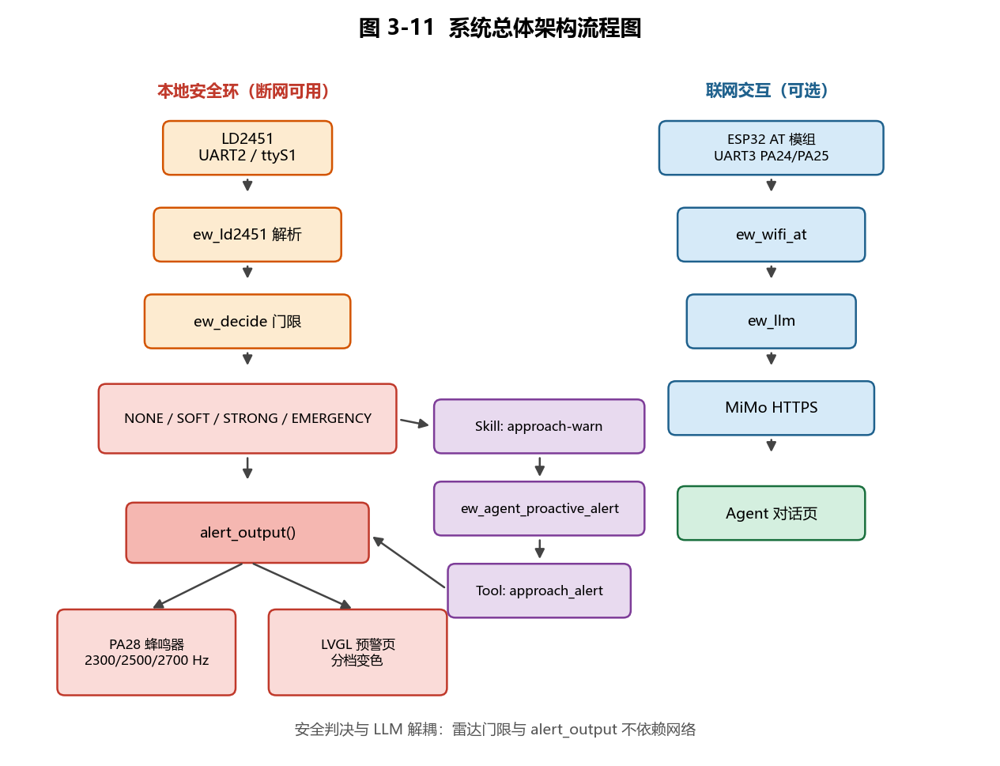{width=13cm}

系统采用“安全判决与语言模型解耦”的设计。雷达数据首先在设备端完成解析和门限判断，只有判定结果满足预设条件时，才触发主动 Agent 告警链路。因此网络状态和大语言模型响应不是本地告警的必要条件。

### 3.2.2 硬件设计

| 组件 | 型号/接口               | 说明                                  |
| -- | ------------------- | ----------------------------------- |
| 主控 | SF32LB52-DevKit-LCD | openvela + LVGL AMOLED              |
| 雷达 | HLK-LD2451          | 24G 毫米波，UART 115200，TX→PA20、RX→PA27 |
| 联网 | ESP8266/32 AT 固件    | PA24→ESP RX，PA25←ESP TX             |
| 告警 | PA28 无源蜂鸣器 + LCD    | 橙色约 2300 Hz，红色约 2700 Hz             |
| 调试 | USB-UART            | 调试 1 Mbps；Windows 环境常见 COM7（随系统配置变化） |

#### 硬件实物照片

**表 3-1 主要硬件组件**

图 2～图 3 为竞赛原型实物与接线，蜂鸣器模块可在图 2 中看到。

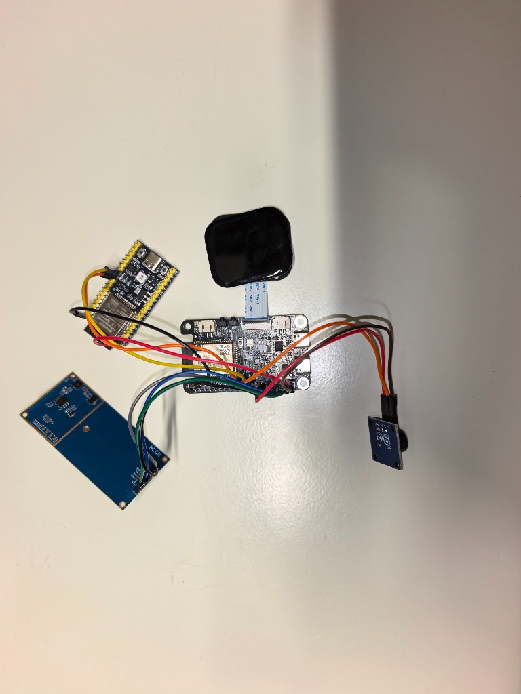{width=10cm}

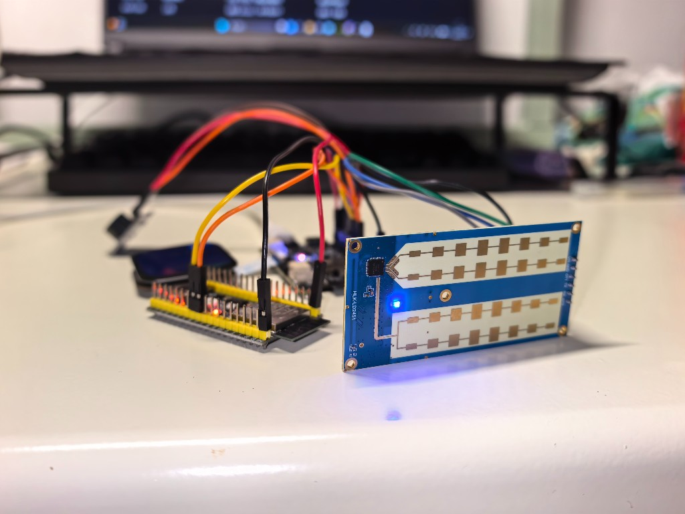{width=11cm}

### 3.2.3 软件模块设计

软件工程位于 `app/edge_walker/`。Codex 重构后采用 **感知 / 策略 / 传输 / 呈现 / 交互** 分层，模块边界见 `ARCHITECTURE.md`：

| 层级 | 模块 | 文件 | 职责 |
| ---- | ---- | ---- | ---- |
| 入口 | NSH | `ew_main.c` | 命令分派 `ew boot` / `ew wifi` / `ew fake` 等 |
| 感知 | 雷达 | `ew_ld2451.c` | UART 帧解析、`ew_decide` 门限；**不访问** WiFi/LVGL |
| 呈现 | 告警出口 | `alert_output.c`、`alert_buzzer.c` | 日志 + PA28 蜂鸣 + 屏色，一处调用三处生效 |
| 呈现 | 预警 UI | `alert_lcd.c` | EW READY / SOFT / WARN / CRIT；`ew_ui_loop` 主循环 |
| 传输 | WiFi AT | `ew_wifi_at.c` | 独占 `/dev/ttyS2`，扫描/连接/HTTPS；**不碰** LVGL |
| 传输 | 链路快照 | `ew_net_state.c` | 线程安全保存 CWJAP/CIPSTA 结果，供 UI 只读 |
| 呈现 | WiFi UI | `ew_wifi_ui.c` | 扫描列表、配网控件；经 API 调 AT，不直连串口 |
| 交互 | 对话 | `ew_chat.c`、`ew_pinyin.c` | Agent 页、屏上键盘、候选字 |
| 交互 | LLM | `ew_llm.c` | MiMo HTTPS；结果枚举映射为用户可见文案 |
| AI | Skill/Tool | `ew_agent.c`、`ew_agent_tool.c` | `approach-warn` → `approach_alert`；不改门限 |
| 调试 | 串口遥控 | `ew_serial_ctl.c` | PC 发 `@goto` / `@ask` / `@fake`，UI 占屏时可用 |
| 调试 | 屏镜像 | `ew_mirror.c` | RGB565 帧经 COM7 输出，配合 `tools/ew_panel.py` |
| 回归 | 主机冒烟 | `host_smoke.c` | 协议与门限回归，**不上板** |

**并发约定**：LVGL 仅 UI 线程触摸；`/dev/ttyS2` 由 `ew_wifi_at` 串行化；Scan/Join/HTTPS 互斥；远程 `@` 命令队列有界，满则丢弃并打日志。

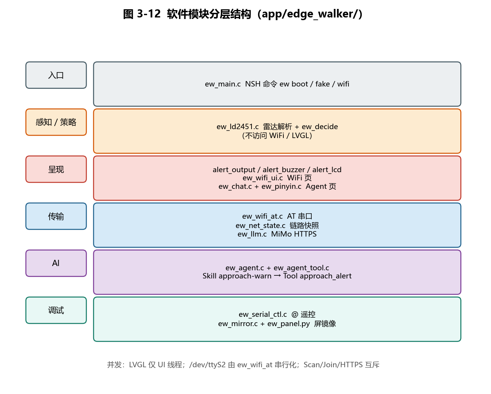{width=13cm}

### 3.2.4 openvela 平台能力落地

本项目在 openvela 平台实际落地图形与 AI 两项能力。

#### 图形显示

基于 LVGL 完成三页 UI：

* 预警页：显示 EW READY、WARN、CRIT 等状态；
* Agent 页：用于 AI 对话；
* WiFi 页：用于网络配置及状态展示。

显示硬件采用 CO5300 QSPI 屏幕，触摸输入采用 FT6146。

图 5～图 8 为三页 UI 与典型运行态真机截图。

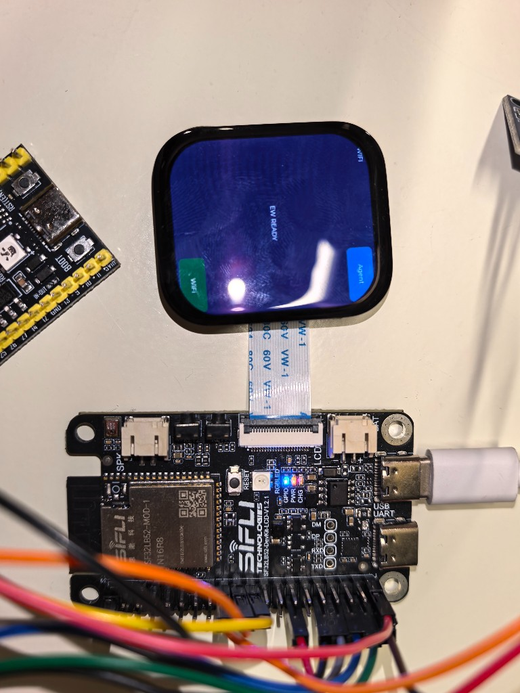{width=9cm}

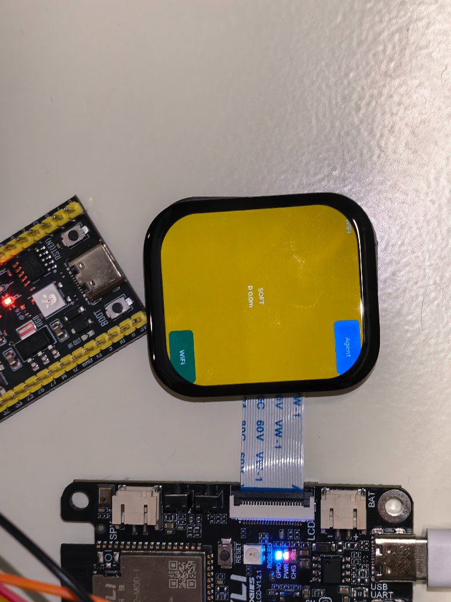{width=9cm}

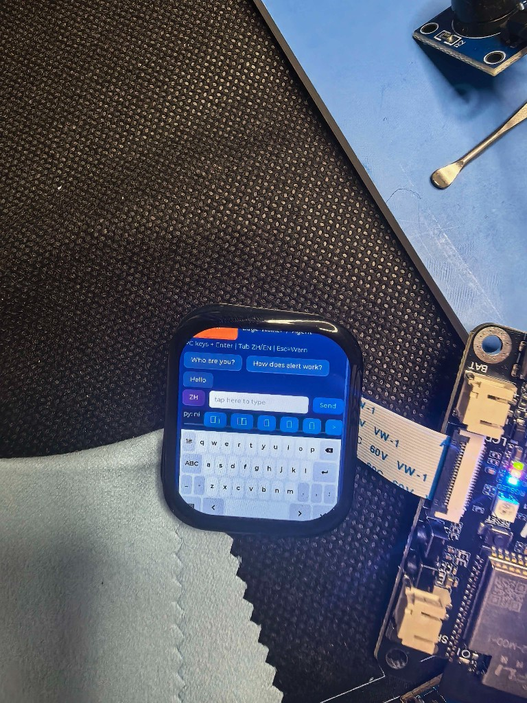{width=9cm}

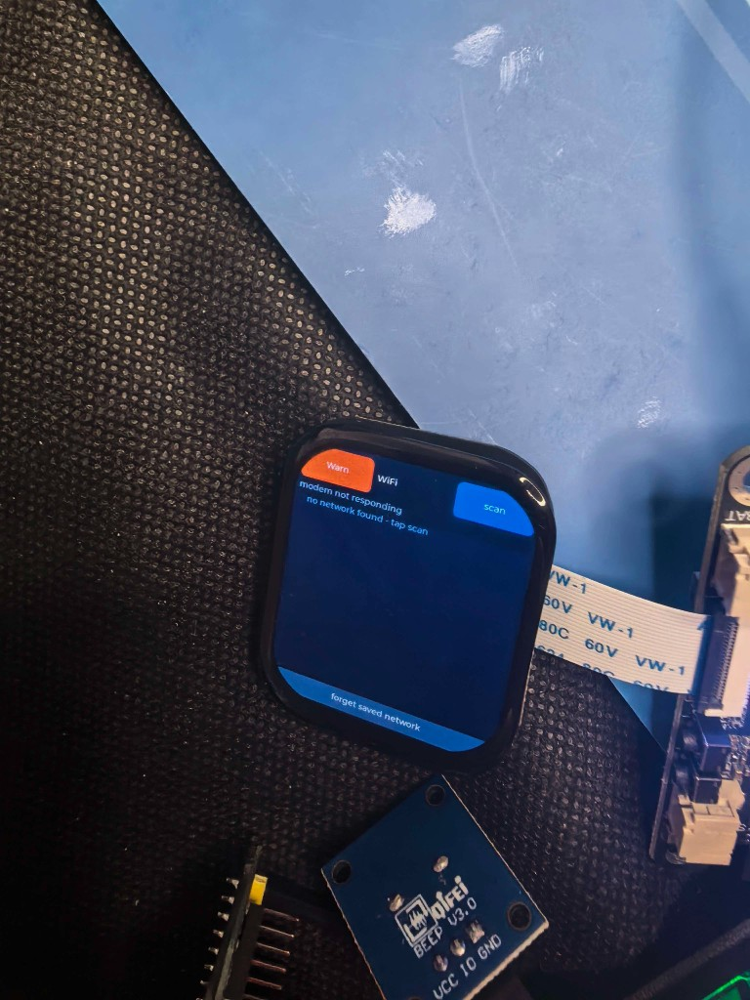{width=9cm}

#### AI 能力

采用 openvela `ai_agent` 能力构建主动告警 Skill（完整链路见图 9）。

MiMo 云端服务只承担对话和信息表达，不参与雷达距离测量、危险等级计算，也不直接决定是否触发安全告警。

#### 多媒体能力

本项目未使用音视频等多媒体能力，相关能力预留用于后续扩展。

#### openvela 组件

项目主要使用：

* NuttX NSH；
* LVGL；
* `vendor/sifli` BSP；
* Contest Kconfig：

```text
CONFIG_LVX_USE_DEMO_CONTEST2026_313_EDGE_WALKER
```

### 3.2.5 构建、烧录与运行

项目支持以下构建方式：

```bash
./build.sh
```

或：

```bash
ninja -C cmake_out/sf32lb52_devkit_lcd
```

生成固件后烧录：

```text
nuttx.bin @ 0x12010000
```

使用 Sifli Downloader 将 `nuttx.bin` 烧录至 `0x12010000`。应用构建开关为 `CONFIG_LVX_USE_DEMO_CONTEST2026_313_EDGE_WALKER`。

系统启动后通过 NSH 命令 `ew` 提供统一功能入口，包括告警测试、假目标注入、WiFi 操作以及 Agent 对话。

### 3.2.6 Skill 与主动告警机制

Skill 名称为：

```text
approach-warn
```

文件路径：

```text
/data/ai_agent/skills/approach-warn.md
```

Skill 在 `ew boot` 时安装，由 `rcS.user` 自动启动流程触发，不采用泛化的“启动 ew”表述。

触发链路见图 9。

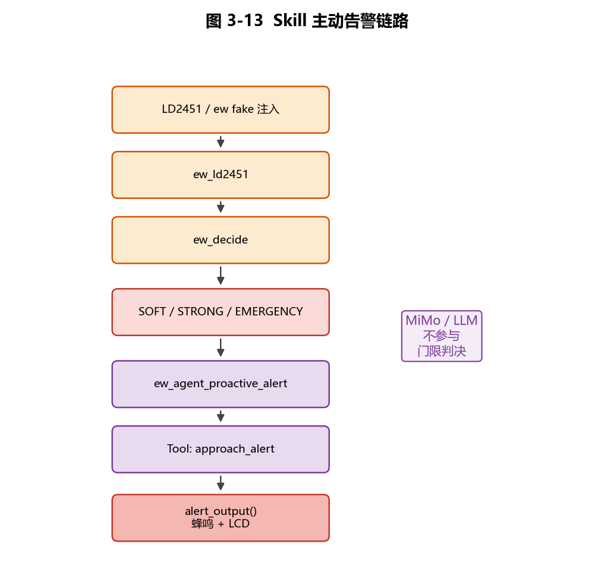{width=12cm}

演示时可通过：

```bash
ew fake 10 20
```

注入假目标，也可使用真实目标靠近设备进行触发。串口日志中可观察到：

```text
[ew_agent]
[alert_output]
```

从而验证 Skill → Tool → 告警输出的完整链路。

### 3.2.7 评审维度自检表

| 评审维度  | 对应章节        | 体现内容                                                     |
| ----- | ----------- | -------------------------------------------------------- |
| 技术难度  | 3.2、3.3、3.4 | LD2451 UART 协议解析、端侧门限判决、openvela/LVGL、Agent Skill + Tool |
| 创新性   | 3.1、3.2、3.3 | 端侧毫米波与本地告警、AI 主动调用机制、安全判决与 LLM 解耦                        |
| 完整度   | 3.2、3.4、3.5 | 硬件、软件、UI、WiFi、Agent、回归测试及演示链路                            |
| AI 开发 | 3.4、3.6     | Cursor Agent、AI 辅助开发、Skill/Tool 设计、日志归档                  |
| 商业潜力  | 3.1、3.7     | 城市通勤辅助安全设备、腰戴式产品形态                                       |
| 展示效果  | 3.4、3.5     | 三页 LVGL UI、分级蜂鸣、实时告警、Agent 对话及断网预警                       |

## 3.3 核心算法与技术原理

### 3.3.1 LD2451 数据解析

LD2451 通过 UART 向主控发送目标信息。系统在 `ew_ld2451.c` 中完成帧接收、字段解析和目标状态提取，并转换为业务层使用的数据结构。

雷达接口配置为：

```text
UART2
/dev/ttyS1
TX → PA20
RX → PA27
115200 baud
```

解析模块与告警输出模块解耦，使协议处理和告警逻辑能够独立进行主机侧测试。

### 3.3.2 本地门限判定

`ew_decide` 根据解析后的目标信息进行分级判断，告警枚举为 `ew_alert_level_t`：

```text
NONE
SOFT
STRONG
EMERGENCY
```

对应门限与输出如下。距离或 TTC 任一条件达到更高档位时，`ew_decide` 采用更高等级；TTC 有效时按距离除以接近速度计算。

| 状态 | 距离门限 | TTC 门限 | UI 显示 | 蜂鸣 |
| --- | --- | --- | --- | --- |
| NONE | 未达到告警条件 | 未达到告警条件 | EW READY | 无 |
| SOFT | $\leq$ 25 m | $\leq$ 5.0 s | 黄/橙色 SOFT | 约 2300 Hz |
| STRONG | $\leq$ 15 m | < 3.0 s | 橙色 WARN | 约 2500 Hz |
| EMERGENCY | $\leq$ 8 m | < 1.5 s | 红色 CRIT | 约 2700 Hz |

正文和程序状态统一使用 `NONE / SOFT / STRONG / EMERGENCY`；UI 分别显示 EW READY、SOFT、WARN、CRIT。上述台架门限定义于 `ew_ld2451.h`，由 `ew_decide` 在设备端直接执行。

### 3.3.3 统一告警出口

系统将所有告警输出统一收敛至：

```c
alert_output()
```

该接口负责：

1. 输出告警日志；
2. 控制 PA28 蜂鸣器；
3. 更新 LVGL 预警界面颜色。

该设计避免不同业务入口分别控制蜂鸣器和 UI，减少状态不同步问题，并便于通过 `ew fake` 验证完整链路。

### 3.3.4 AI Agent 主动触发机制

AI 功能采用 Skill + Tool 结构，但不承担底层安全判断。

当 `ew_decide` 产生 SOFT、STRONG 或 EMERGENCY 状态时，经 `ew_agent_proactive_alert` → `approach_alert` → `alert_output()`（见图 9）。

因此，LLM 所处位置属于高层交互与信息表达层，传感器数据解析和告警触发条件由本地确定性程序完成。

该架构使系统在无网络条件下仍能够执行本地预警，同时保留联网状态下的 Agent 交互能力。

## 3.4 系统实现

### 3.4.1 预警 UI

系统基于 LVGL 实现三页 UI（`EW_PAGE_WARN` / `CHAT` / `WIFI`），由 `ew_ui_goto()` 切换，各页实现 `build / tick / teardown` 钩子。预警页状态机见图 10。

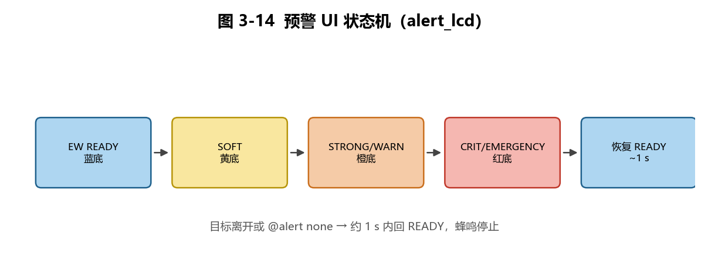{width=12cm}

雷达未收到有效帧时显示 **NO RADAR**（见图 11），不影响 NSH 手动 `ew alert` / `ew fake` 演示。

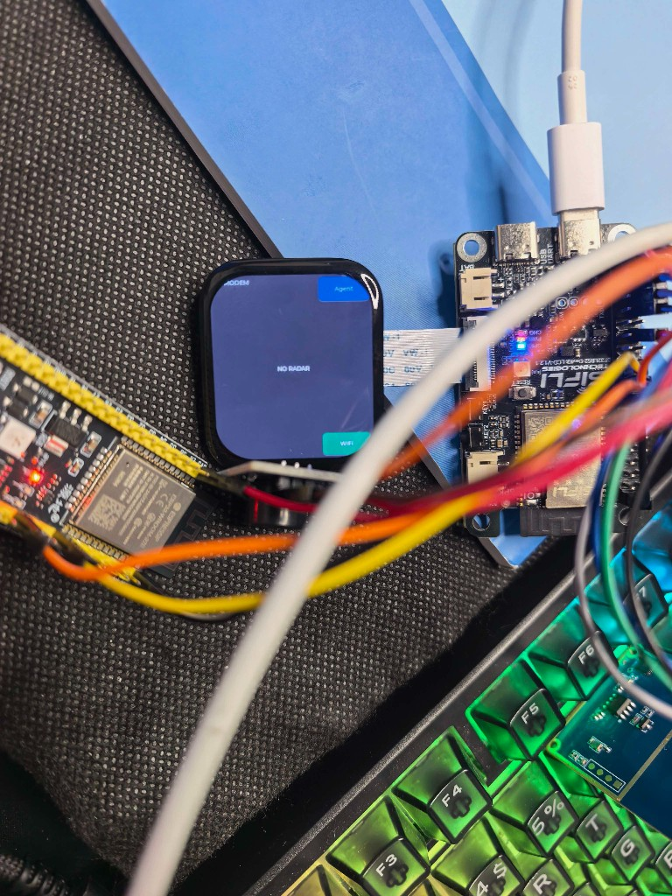{width=9cm}

告警与 `alert_output()` 联动；帧循环 `EW_UI_FRAME_MS = 8 ms`；切页防抖 `EW_UI_GATE_MS = 400 ms`。

### 3.4.2 Agent 对话页

Agent 页由 `ew_chat.c`（控件）+ `ew_llm.c`（MiMo HTTPS）+ `ew_pinyin.c`（中文候选）组成。联网后支持快捷句 **Who are you?** / **How does alert work?** 及 `ew ask`；错误文案由 `ew_llm_result_t` 映射，**不**从凭证文件推断链路状态。

MiMo 使用中国集群 `token-plan-cn.xiaomimimo.com`，密钥经 Host 脚本 `mimo_configure.py` 写入 `/data/ai_agent/config/`，**不进 git/固件**。

**演示建议**：小屏触控难拍时，可用 PC `ew_panel` 或串口 `@goto chat`、`@ask …` 与实物屏并列录屏（见 Demo clip_D）。

### 3.4.3 WiFi 功能

外挂 **YD-ESP32（ESP32-WROOM-32E）** AT 固件，UART3 `/dev/ttyS2` @115200（PA24→ESP RX，PA25←ESP TX），实物见图 12。

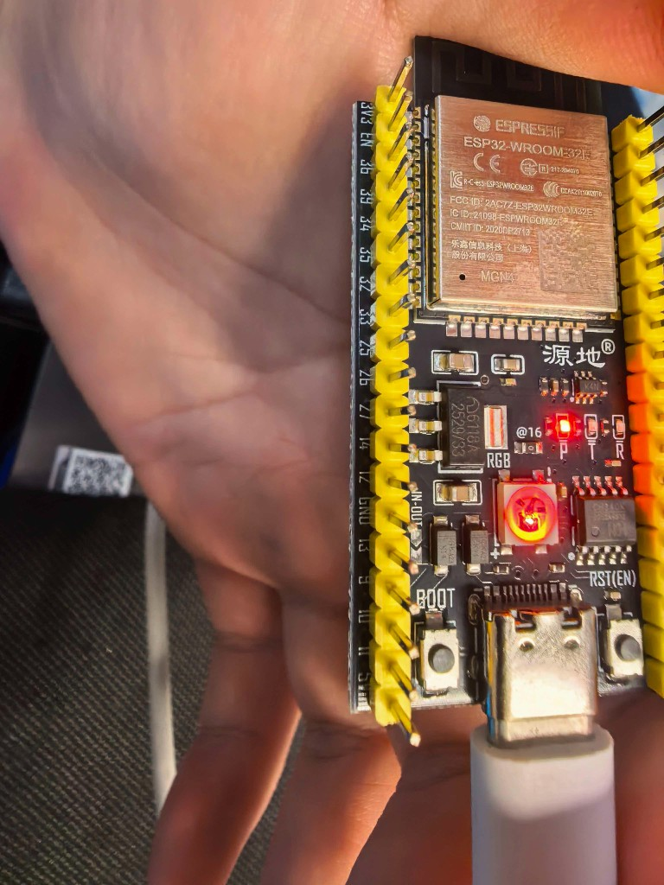{width=8cm}

**软件分层**：`ew_wifi_at.c` 独占串口；`ew_net_state.c` 供 UI 读链路快照；`ew_wifi_ui.c` 负责扫描列表与配网。凭证存 `/data/ew_wifi.conf`，不硬编码。

**状态语义**（`ew wifi ping` 四层）：MODEM → WIFI → LAN(IP) → ONLINE( ping 223.5.5.5 )。屏上 **LAN ONLY** 表示已关联热点有 IP 但公网 ping 未过；**modem not responding** 表示 AT 未唤醒（见图 8），需查接线/COM 独占/RTS 关闭。

NSH：`ew wifi ping` / `ew wifi scan` / `ew wifi join "SSID" "pass"`。演示可用 `@goto wifi`、`@join SSID pass`（clip_E）。

### 3.4.4 NSH 与 PC 远控入口

项目以 NSH 命令 `ew` 为统一入口；UI 运行时另提供 **`@` 遥控**（`ew_serial_ctl.c` 读 `/dev/console`）：

```text
@goto warn|wifi|chat    @alert soft|strong|none
@fake 10 20             @ask Who are you?
@mirror on|off          @join SSID password
```

Host 工具：`tools/ew_panel.py`（镜像 + 按钮）、`scripts/host/nsh_cmd.ps1`（COM7 @ 1 Mbps）。与 Codex 调试规范见仓库 `.agents/skills/devkit-serial-debug/`。

核心操作包括：

```text
ew alert soft
ew alert strong
ew alert crit
ew fake 10 20
ew wifi ping
ew wifi scan
ew ask
ew boot
```

其中 `ew alert crit` 用于红色告警档演示，内部映射为 STRONG 或 EMERGENCY。

### 3.4.5 主机侧回归测试

项目提供：

```text
host_smoke.c
```

用于主机环境下对核心解析与业务逻辑进行回归。

当前已验证：

```bash
gcc host_smoke.c ew_ld2451.c && ./host_smoke
```

结果：

```text
ALL PASS
```

## 3.5 系统测试与结果分析

### 3.5.1 功能测试

| 测试项 | 步骤 | 预期 | 结果 |
| --- | --- | --- | --- |
| 主机回归 | 运行 `host_smoke` | 全部检查通过 | ALL PASS |
| 三档告警 | 依次执行 `ew alert` | 屏色与蜂鸣随等级变化 | 已验证 |
| 假目标链路 | 执行 `ew fake 10 20` | 输出完整告警日志 | 已验证 |
| 断网预警 | 断网后触发 `fake` | 本地告警仍工作 | 已验证 |
| WiFi AT | 执行 `ping` / `scan` | 返回分层网络状态 | 已验证 |
| Agent 对话 | 快捷句或 `ew ask` | 返回模型回复 | 已验证 |
| Skill 主动告警 | 触发越限目标 | Tool 进入统一出口 | 已验证 |
| 真实道路靠近 | 普通自行车、共享单车或电动车从侧后方接近雷达 | 设备产生对应告警响应 | 已验证（定性） |

证据说明：WiFi 状态可在图 8 与提交视频联网片段中核对；Agent 页面见图 7；Skill 链路使用 `ew fake 10 20`，串口同时输出 `[ew_agent]` 与 `[alert_output]`；提交视频包含真实道路场景下自行车和电动车驶近画面，并与开发板屏幕告警响应对照。普通自行车、共享单车及电动车接近均作为真机定性验收对象；正式路测次数、准确率及误报/漏报量化不在本阶段结论范围内。

### 3.5.2 已验证指标与量化边界

| 指标             | 实测值                                                        |
| -------------- | ---------------------------------------------------------- |
| UI 帧循环周期       | EW_UI_FRAME_MS = 8 ms                                      |
| 告警恢复延迟         | 约 1 s（`EW_CLEAR_MS` 设计值；真机目视与 Demo clip_B）              |
| host_smoke 检查点 | 19 项（按 `host_smoke.c` 中独立断言计，输出 ALL PASS）           |
| 真实道路场景测试       | 已完成自行车与电动车接近的定性演示；未统计测试总次数                          |
| 真实道路误报数量       | 未形成量化统计                                                  |
| 真实道路漏报数量       | 未形成量化统计                                                  |
| 连续运行时长         | 台架连续运行不少于 30 min（开发调试期，未做 formal soak test）          |
| 固件大小           | `nuttx_wifiui.bin` 约 1,601,812 B（含 WiFi UI + `serial_ctl`） |

### 3.5.3 测试结果分析

目前已经完成核心软件链路和基础真机演示验证。

主机侧 `host_smoke` 已达到 `ALL PASS`，说明当前协议解析与相关逻辑具备基本回归验证条件。手动三档告警和 `ew fake` 已验证从业务状态到 `alert_output()` 的输出路径。

断网测试表明，本地雷达与告警链路不依赖 WiFi，可以在没有网络连接的情况下完成基础预警。

真实道路场景下的自行车与电动车接近已完成定性演示，说明原型具备面向目标场景的响应能力；该演示不等同于正式道路数据集，也不用于推导检测准确率或误报/漏报率。

竞赛原型阶段以 **分档预警、断网可用、真实道路接近演示、Agent/Skill 链路可演示** 为主；正式路测的误报/漏报统计留待产品化阶段补充。完整功能演示见提交视频 `边缘行者-Demo-contest2026_313_bianyuanxingzhe.mp4`（分镜方案归档于 `docs/提交材料/archive/demo_work/拍摄指导_硬件照片与Demo视频.md`）。

## 3.6 AI-Native 开发说明

### 3.6.1 AI Coding 工具

项目主开发工具为：

```text
Cursor Agent
```

AI Coding 代码占比估算为：

```text
约 70–85%
```

该比例为开发过程估算，口径为代码起草、模块实现及测试代码中 AI 生成或辅助生成内容的比例，并非自动化统计结果。

核心 C 模块多数由 Cursor Agent 起草，再由开发人员人工校对并完成真机联调。

其中 `ew_decide` 门限、`alert_output` 与 LD2451 解析均经人工校对和真机验收；AI 主要辅助框架、UI 与工具代码。

### 3.6.2 AI 参与方式

Cursor Agent 主要用于：

* 文档和代码骨架生成；
* 驱动及模块结构编写；
* LD2451 协议解析代码起草；
* NSH 命令及业务模块实现；
* 调试辅助和问题定位；
* 测试代码与回归逻辑编写。

实际硬件相关参数由人工确认，包括：

* UART 引脚；
* PA28 蜂鸣器控制；
* UART 多字节发送；
* LVGL 触摸边距；
* 雷达真实数据与设备行为。

因此，AI 代码生成与实际硬件验证形成“AI 起草—人工校对—真机联调”的开发流程。

### 3.6.3 日志与过程归档

官方日志目录当前包含：

```text
logs/zixuanzheng2007-stack/
```

其中 Codex 会话使用 schema 1.0，并通过官方 `validate-log.py`。本项目早期 Cursor Agent 会话已经成功导出为 transcript 转换 JSONL；官方工具最新版也已支持 Cursor SQLite backfill，但明确只采集新版全局 `cursorDiskKV` Composer 数据，不支持 legacy transcript/旧存储格式。本项目在 Host 与 Guest 均未匹配到可由该新版适配器回填的 Composer，因此原样保存在：

```text
docs/提交材料/archive/supplemental_cursor_logs/
```

这些 Cursor 记录是有效的历史开发档案，但不冒充带源 SQLite 完整性证据的官方 `backfill-cursor` 产物；历史 JSONL 正文未被修改。

### 3.6.4 MCP 与 Skills

当前状态：

| 项目                  | 状态  |
| ------------------- | --- |
| VelaJS MCP          | 未使用 |
| Figma MCP           | 未使用 |
| approach-warn Skill | 已新增 |
| approach_alert Tool | 已实现 |

新增 Skill：

```text
skills/approach-warn.md
```

在 `ew boot` 时安装至：

```text
/data/ai_agent/skills/approach-warn.md
```

### 3.6.5 Token 与模型使用

2026 年 9 月 MiMo 控制台汇总显示：模型为 `mimo-v2.5`，共发起 **44 次请求**，Token 总消耗为 **28,057**。9 月 18 日联调与 Demo 准备形成当月用量峰值。API Key 仅以脱敏配置形式存放于设备 `/data/ai_agent/config/`，不进入 git；报告不展示任何 Key 内容。

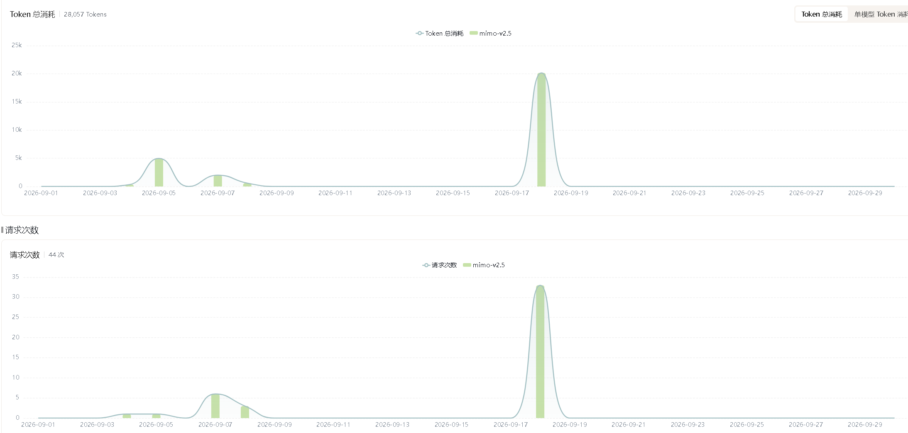{width=15cm}

### 3.6.6 AI-Native 开发效果与问题

AI 辅助开发主要提升了文档生成、驱动代码骨架、协议解析及模块化代码实现效率。

真实硬件环境中的以下工作仍由人工完成：

1. 引脚及外设连接必须结合实际硬件确认；
2. UART 多字节 TX 等问题需要结合设备实际行为定位；
3. LVGL 触摸边距等 UI 细节需要真机反复调试；
4. AI 生成代码无法替代串口日志和真实设备验证。

因此，本项目中的 AI-Native 开发不是完全自动化开发，而是将 Agent 作为工程开发协作者，并通过人工硬件验证保证最终系统行为。

### 3.6.7 版权与第三方合规

- 本仓库应用代码在 AI 辅助下编写，遵循 **Apache License 2.0**（见根目录 `LICENSE`、`NOTICE`）。
- 编译依赖 openvela / NuttX / LVGL / SiFli BSP，通过 `repo sync` 获取，**未**将第三方 C 库 vendoring 进专属仓。
- LD2451 解析按海凌科公开串口协议 V1.03 自研；LVGL 初始化参考 openvela 官方 `lvgldemo` 文档化流程。
- SiFli 原厂设计文件与 Wiki **不以镜像形式入库**，仅保留外链与本队接线摘要文档。

## 3.7 总结与展望

### 3.7.1 项目总结

“边缘行者”围绕城市步行过程中侧后方自行车（含共享单车）及静音电动车接近这一具体安全场景，实现了基于 openvela 的端侧毫米波预警原型。

当前已完成：

| 能力                  | 状态       |
| ------------------- | -------- |
| LD2451 UART 接入及协议解析 | 已实现      |
| `ew_decide` 本地门限判定  | 已实现      |
| 分级屏幕告警              | 已实现      |
| PA28 蜂鸣告警           | 已实现      |
| LVGL 三页 UI          | 已实现      |
| WiFi AT 接入          | 已实现      |
| MiMo Agent 对话       | 已实现      |
| approach-warn Skill | 已实现      |
| approach_alert Tool | 已实现      |
| 主机侧 `host_smoke`    | ALL PASS |
| 断网本地预警              | 已验证      |
| `ew fake` 告警链路      | 已验证      |

项目的核心设计原则是将安全相关的感知和判决留在设备端，将 AI 用于交互和主动信息表达。这样既利用大模型的自然语言能力，又避免底层安全判决依赖网络和 LLM 响应。

### 3.7.2 当前不足

当前系统仍存在以下不足：

1. 尚未加入 IMU 辅助降敏机制；
2. 尚未完成正式路测数据集；
3. 尚未形成大规模真实环境误报、漏报统计；
4. 固件已内嵌 OFL 授权的思源黑体 GB2312 字库；GB2312 外字符会可控替换，完整 Unicode 仍需可选 OFL 外部字体；
5. 当前官方有效日志覆盖 Codex 阶段；更早的 Cursor 过程记录仅作为补充档案；
6. 当前产品仍处于 DevKit-LCD + 外挂雷达原型阶段；
7. 竞赛原型采用 PA28 蜂鸣 + LCD 变色进行告警，未实现震动马达。

### 3.7.3 后续展望

后续工作主要围绕产品化和环境适应性展开。

在硬件方面，可从开发板外挂方案向腰戴式环状设备演进，并增加振动反馈，形成声音、视觉与触觉相结合的提示方式。

在感知方面，可增加 IMU 辅助信息以降低部分运动状态下的误报，并通过正式路测建立更完整的数据集。

在软件方面，可进一步扩展 GB2312 之外的 Unicode 字形覆盖、官方日志覆盖和多场景测试，并持续扩展 AI Agent 的交互能力。

在生态方面，未来可探索与导航 App 等移动端系统通过 BLE 进行联动，但该功能当前尚未实现，不属于本阶段产品能力。

### 3.7.4 演示与提交

最终 Demo 视频控制在 5 分钟以内，采用 **分段录制、剪辑合成** 方式，重点展示：

道路场景与设备响应对照；分档预警（clip_B）与断网预警（clip_C）；Agent（clip_D）与 WiFi（clip_E）；Skill 主动执行证据（clip_F）。

道路场景段将自行车/电动车驶近画面与开发板屏幕响应并列展示；WiFi 与 Agent 段采用 **PC 远控（ew_panel / 串口 @）与实物屏并列录屏**，降低小屏触控拍摄难度。

源码及日志位于 GitHub 专属仓库，并按要求提交至：

```text
dev-ai-contest-2026
```

最终压缩包命名为：

```text
边缘行者-边缘行者-contest2026_313_bianyuanxingzhe.zip
```

# 4、修订记录

| 版本   | 修订内容                                           | 状态      |
| ---- | ---------------------------------------------- | ------- |
| V0.x | 初稿迭代：完善摘要、测试结构、事实边界、AI-Native 说明与技术术语 | 完成 |
| V1.0 | 完善摘要、章节、术语、封面目录、图注及验收/演示引用 | 2026-09-18 |
| V1.1 | 对齐模块边界，嵌入 UI、WiFi、Agent 与规格图 | 2026-09-19 |
| V1.2 | 修正 A4、目录/图注、测试表及打包图片范围 | 2026-09-19 |
| V1.3 | 场景扩展至自行车（含共享单车）与静音电动车 | 2026-09-19 |
| V1.4 | 补 MiMo 用量图，修正告警档位、摘要、烧录与调试说明 | 2026-09-19 |
| V1.5 | 补自行车/电动车道路定性演示证据，明确量化边界 | 2026-09-19 |
